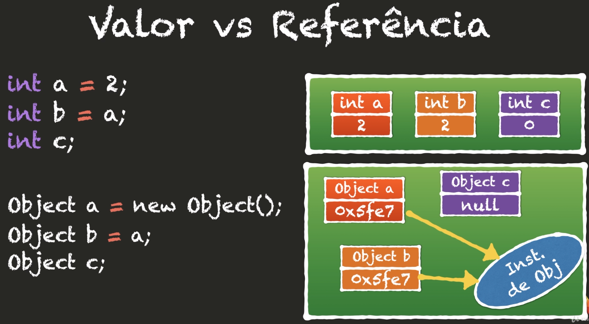
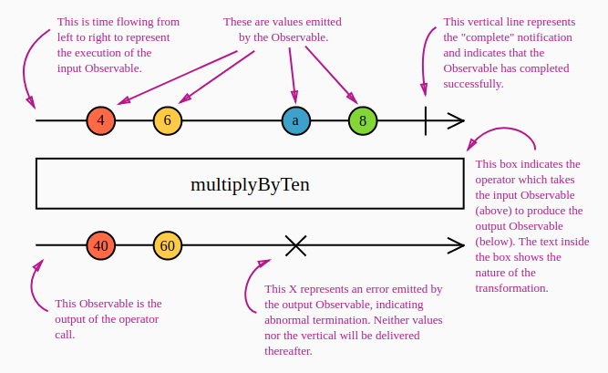

## Functional and reactive JavaScript

> Here is my functional programming studies

### Programming paradigms:

- The paradigms are the base of the knowledge for a great solutions;
- Paradigms are a mental models, so you need a pattern for follow;
- New languages === easy && new paradigms === hard;
- Paradigms and patterns;
- [Observer pattern](https://en.wikipedia.org/wiki/Observer_pattern);
- [Functional](https://en.wikipedia.org/wiki/Functional_programming) created in 1957;
- [Procedural](https://en.wikipedia.org/wiki/Procedural_programming) created in 1968;
- [Object orientation](https://en.wikipedia.org/wiki/Object-oriented_programming) created in 1980/90;

### Declarative vs Imperative

- The declarative code style does not say how, but what the imperative already says how and teaches the computer;

```
Imperative      | Declarative
Flow focus      | Logic focus
Mutate state    | Immutability
How             | What
More code       | Less code
Low scalability | Higher scalability
More knowledged | Less knowledged
More explicit   | Less explicit
```

- Showing the differences:

```
Imperative

SQL:
SELECT registration, name, email, average FROM students WHERE average >= 9;

HTML:
<div>
  <div>Hello world</div>
</div>

JavaScript Imperative:
const grades = [8.7, 6.8, 7.7, 7.7, 9.2, 5.3, 8.0];

function average(grades) {
  let total = 0;
  for(let i = 0; i < grades.length; i++) {
    total += grades[i];
  }

  return total / grades.length;
}

const averageClass = average(grades);
console.log(`Average is ${averageClass}`);

JavaScript Declarative:
const grades = [8.7, 6.8, 7.7, 7.7, 9.2, 5.3, 8.0];

const sum = (a, b) => a + b;
const divide = (a, b) => a / b;

const averageClass = divide(grades.reduce(sum), grades.length);

console.log(`Average is ${averageClass}`);
```

### Functional paradigm

- First Class Functions;
  - Functions are values;

```
const students = [
  { name: "Ana", grade: 8.5 },
  { name: "Bia", grade: 7.3 },
  { name: "Gil", grade: 5.8 },
  { name: "Leo", grade: 7.6 },
  { name: "Gui", grade: 9.1 },
  { name: "Lia", grade: 4.9 },
  { name: "Rui", grade: 7.0 },
  ];

// Imperative way
const aproved = [];

for (let i = 0; i < students.length; i++) {
  if (students[i].grade >= 7) {
    aproved.push(students[i]);
  }
}

console.log(aproved);

// Functional way
const isAproved = (student) => student.grade >= 7;

const aproved = students.filter(isAproved);

console.log(aproved);
```

- Imutability;
- PLOP (Term invented by closure creator);
  - Place-Oriented Programming;
  - New information overwrite the old ones;
  - Emerged because a computation limitation;
    - Low RAM and low hard disk;
- Why change?
  - Functional programming is more simple;
    - make it easier to write and maintain code;
  - No time coupling;
  - Few competition problems;
  - Works with immutability;
- You can forget everything but ...
  - Isolated immutability;
  - Shared immutability;
- Current scenario:
  - Abundant memory;
  - Multiple processors.

<h3 align="center">Value vs Reference</h3>
<p align="center">
  
</p>

### How JavaScript Works

- JavaScript is a single thread language;
- Heap;
- Event Loop;
- Garbage Collector;
- Stack;
- Event Queue;

### RxJs

- [Official Docs](https://rxjs-dev.firebaseapp.com/guide/overview);

#### Operators

> Operators are functions. There are two kinds of operators (Pipeable and Creation Operator)

- Pipeable: these operators are the kind that can be piped using the syntax `observableInstance.pipe(operator())`. these include `filter()`, `mergeMap()`, etc. Essentially pipeable operators are pure functions;
- Creation Operators: are the other kind of operators. which can be called as standalone functions to create a new Observable;
- Marble diagrams, why use them for explain operators? from RxJs docs: To explain how operators work, textual descriptions are often not enough. Many operators are related to time, they may for instance delay, sample, throttle, or debounce value emissions in different ways. Diagrams are often a better tool for that. Marble Diagrams are visual representations of how operators work, and include the input Observable(s), the operator and its parameters, and the output Observable.

> In a marble diagram, time flows to the right, and the diagram describes how values ("marbles") are emitted on the Observable execution.

#### Marble diagram example:

<p align="center">
  
<p>

#### Pull vs Push

```
| Type | Single   | Multiple  |
| PULL | Function | Iterator  |
| PUSH | Promise  | Observable|
```
